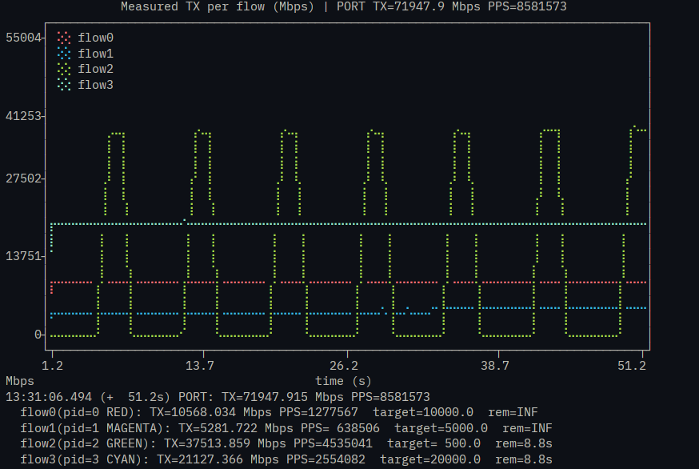

# PIPO-TG: Parameterizable High Performance Traffic Generation
⚠️**This repository is in state of development**

## About PIPO-TG
PIPO-TG is a parameterizable traffic generator designed for Intel Tofino™ ASIC. Enabling users to define traffic workloads in a user-friendly interface. PIPO-TG supports configurable traffic behavior such as multiple flows, per-flow throughput control, packet-size definition, src IP randomization, custom header definition, and optionally works asside with a user P4 code. By simplifying the deployment and usability in terminal, PIPO-TG helps researchers to produce repeatable experiments on real programmable hardware.
Use this Markdown-ready version:

## Publication and references

PIPO-TG is an artifact associated with a paper published at IEEE/IFIP NOMS 2024: [PIPO-TG: Parameterizable High-Performance Traffic Generation](https://ieeexplore.ieee.org/document/10575636). Since its publication, this repository has continued to receive updates and improvements.

It is also highly recommended to check the [Tofino Native Architecture documentation](https://github.com/barefootnetworks/Open-Tofino/blob/master/PUBLIC_Tofino-Native-Arch.pdf), especially for details about packet generation, TNA metadata, ports, parser/deparser behavior, and Tofino-specific constraints.


# Requiriments
- git
- Python 3
- `plotext` Python package, required only when terminal graph visualization is enabled
- Intel Tofino-1 switch
- Intel BF-SDE installed and configured
- For the Python scripts to successfully process network configurations and for the SDE scripts to access hardware interfaces, **superuser (`sudo`) privileges are mandatory**

# Usage
> We tested this project in Tofino-1 with Intel BF-SDE versions 9.12.0 and 9.13.2.

**1. Set the environment variables.**

The SDE environment variables are usually set from the SDE directory with:
```bash
. ~/user/tools/set_sde.bash`
```
**2. Define the traffic behavior**
> Check the examples and syntax definitions

- Edit `main.py` and describe the traffic you want to generate.
- Then execute `main.py`
```terminal
$ python3 main.py
```
 
**3. Run**
- Run `execut.sh`
```terminal
$ ./execut.sh
```
 
# Syntax and examples
PIPO-TG traffic is defined in `main.py`. The user creates a Generator, defines global generation settings, adds one or more flows, and then calls `generate()` to create the output files in the `files/` directory.

## Mandatory definitions
Every PIPO-TG input script must import the traffic generator classes, instantiate a Generator, define the packet-generation port, and call `generate()` at the end of the file.

```python
from src.data import Generator
from src.headers import Field, Header

tg = Generator()

tg.addGenerationPort(68)
tg.setThroughputMode("meter")
tg.enableGraph()  # optional

# Add custom headers and flows here

tg.generate()
```
The `addGenerationPort()` method defines the internal Tofino packet-generation port used by the generated control-plane configuration. The `setThroughputMode()` method selects the throughput-control mechanism used by the generated files (actually legacy function). The `enableGraph()` method enables the runtime traffic graph using **plotext lib** in the generated execution script.

Example of real-time terminal output with `enableGraph()`:


## Custom header definition
Custom headers can be declared using the Header and Field classes. A header is created with a name and a total size in bits. Then, fields are added to describe the internal structure of the header.
```python
myhdr = Header(name="myhdr", size=16)
myhdr.addField(
    [
        Field("msg_type", 8, default_value=1),
        Field("flags", 4, default_value=0),
        Field("reserved", 4, default_value=0),
    ]
)

tg.addHeader(myhdr)
```
The sum of all field sizes must match the total header size. In this example, the header has 16 bits: 8 bits for msg_type, 4 bits for flags, and 4 bits for reserved.

## Flow definition
A flow represents one traffic stream. Each flow is created with `tg.addFlow()`.
```python
f0 = tg.addFlow()
```

After creating a flow, the user must define the output port, packet template, throughput, and optionally the flow duration.

### Output port definition
The `outputPort()` method defines the physical output port used by the flow.
```python
f0.outputPort("10/-", 52, "100G")
```

The method receives three parameters:
```python
f0.outputPort(front_panel_port, dev_port, bandwidth)
```

| Parameter          | Description                                                                                          |
| ------------------ | ---------------------------------------------------------------------------------------------------- |
| `front_panel_port` | Physical/front-panel port label.                       |
| `dev_port`         | Tofino device port ID(`D_P`).                  |
| `bandwidth`        | Port bandwidth (e.g.,`"10G"`, `"25G"`, or `"100G"`). |

The configured bandwidth must be compatible with the physical port and cable being used. A Tofino 100G port can be configured as a single 100G port or broken into multiple lower-speed channels, depending on the platform and port configuration.

For example, when using a QSFP-to-4xSFP+ breakout cable connected to four server ports, the port should not be configured as `"10/-"` at `"100G"`. Instead, each channel should be configured separately, such as `"10/0"`, `"10/1"`, `"10/2"`, and `"10/3"`, with the corresponding speed and device port ID for each channel.

Example using the full 100G port:
```python
f0.outputPort("10/-", 52, "100G")
```

Example using one channel of a breakout port:
```python
f0.outputPort("10/0", 52, "10G")
```

The exact `dev_port` depends on the switch port mapping. Always verify the physical port, channel, and `D_P` value using the switch port status or port mapping before running the generated configuration.

### IPv4 packet definition
The `addIP()` method defines the Ethernet/IPv4 packet template used by the flow. It can be called with no arguments, using the default values, or with user-defined fields.

Full syntax with default values:
```python
f0.addIP(
    pktlen=64,
    eth_dst="00:01:02:03:04:05",
    eth_src="00:06:07:08:09:0a",
    ip_src="192.168.0.1",
    ip_dst="192.168.0.2",
    ip_tos=0,
    ip_ttl=64,
    ip_id=0x0001,
    ip_ihl=None,
    ip_proto=0,
    ether_type=0x0800,
    srcRandom=False,
    srcMask="/24",
)
```

| Parameter    |         Default value | Description                                                                                  |
| ------------ | --------------------: | -------------------------------------------------------------------------------------------- |
| `pktlen`     |                  `64` | Total packet length in bytes. Current version requires the same packet length for all flows. |
| `eth_dst`    | `"00:01:02:03:04:05"` | Ethernet destination MAC address.                                                            |
| `eth_src`    | `"00:06:07:08:09:0a"` | Ethernet source MAC address.                                                                 |
| `ip_src`     |       `"192.168.0.1"` | IPv4 source address.                                                                         |
| `ip_dst`     |       `"192.168.0.2"` | IPv4 destination address.                                                                    |
| `ip_tos`     |                   `0` | IPv4 Type of Service field.                                                                  |
| `ip_ttl`     |                  `64` | IPv4 Time To Live field.                                                                     |
| `ip_id`      |              `0x0001` | IPv4 identification field.                                                                   |
| `ip_ihl`     |                `None` | IPv4 Internet Header Length.                                                                 |
| `ip_proto`   |                   `0` | IPv4 protocol field.                                                                         |
| `ether_type` |              `0x0800` | Ethernet type. `0x0800` represents IPv4.                                                     |
| `srcRandom`  |               `False` | Enables randomization of the IPv4 source address.                                            |
| `srcMask`    |               `"/24"` | Prefix mask used when `srcRandom=True`.                                                      |

Example with only the most common fields changed:
```python
f0.addIP(
    pktlen=1024,
    ip_src="192.168.0.1",
    ip_dst="10.0.0.2",
)
```

### Throughput definition
The `addThroughput()` method defines the target throughput of the flow in Mbps.

Fixed throughput:
```python
f0.addThroughput(5000)  # 5000 Mbps
```

Time-varying throughput:
```python
f0.addThroughput([500, 50000], [5, 2]) # variance: 500Mbps/5s, 50000Mbps/2s
```

### Flow duration
The `addDuration()` method defines the total duration of the flow in seconds.

```python
f0.addDuration(60)
```

In this example, the flow remains active for 60 seconds. If no duration is defined, the flow is treated as continuous.

## Example 1: simple IPv4 traffic

The example below generates IPv4 traffic at 100 Mbps to destination IP `10.0.0.2`. The packets are sent through physical port `5/-`, mapped to Tofino device port `160`, configured as a 100G port.

```python
from src.data import Generator
from src.headers import Field, Header

tg = Generator()

tg.addGenerationPort(68)
tg.setThroughputMode("meter")
tg.enableGraph()

f0 = tg.addFlow()

f0.outputPort("5/-", 160, "100G")

f0.addIP(
    pktlen=1024,
    ip_src="192.168.0.1",
    ip_dst="10.0.0.2",
)

f0.addThroughput(100)

tg.generate()
```

## Example 2: burst traffic

The next example defines burst traffic using time-varying throughput. The flow sends regular traffic at 10 Gbps for 8 seconds, followed by a burst of 90 Gbps for 2 seconds.

```python
from src.data import Generator
from src.headers import Field, Header

tg = Generator()

tg.addGenerationPort(68)
tg.setThroughputMode("meter")
tg.enableGraph()

f0 = tg.addFlow()

f0.outputPort("5/-", 160, "100G")

f0.addIP(
    pktlen=1024,
    ip_src="192.168.0.1",
    ip_dst="10.0.0.2",
)

f0.addThroughput([10000, 90000], [8, 2])

tg.generate()
```

This configuration repeats the throughput pattern defined by the two lists. The first list defines the throughput values in Mbps, and the second list defines the duration of each throughput interval in seconds.

## Example 3: randomized source IP traffic

The following example represents a DDoS traffic scenario. The flow sends traffic at 10 Gbps to the target destination IP `192.168.2.2`. The source IP is randomized inside the `192.168.1.0/24` prefix.

```python
from src.data import Generator
from src.headers import Field, Header

tg = Generator()

tg.addGenerationPort(68)
tg.setThroughputMode("meter")
tg.enableGraph()

f0 = tg.addFlow()

f0.outputPort("5/-", 160, "100G")

f0.addIP(
    pktlen=1024,
    ip_src="192.168.1.0",
    ip_dst="192.168.2.2",
    srcRandom=True,
    srcMask="/24",
)

f0.addThroughput(10000)

tg.generate()
```

This configuration keeps the same destination IP address while varying the source IP address according to the configured prefix.

## Team

- **Filipo G. Costa**, Federal University of Pampa (UNIPAMPA), Brazil
- **Francisco G. Vogt**, University of Campinas (UNICAMP), Brazil
- **Fabricio Rodrıguez Cesen**, University of Campinas (UNICAMP), Brazil
- **Ariel Goes de Castro**, University of Campinas (UNICAMP), Brazil
- **Marcelo Caggiani Luizelli**, Federal University of Pampa (UNIPAMPA), Brazil 
- **Christian Esteve Rothenberg**, University of Campinas (UNICAMP), Brazil

